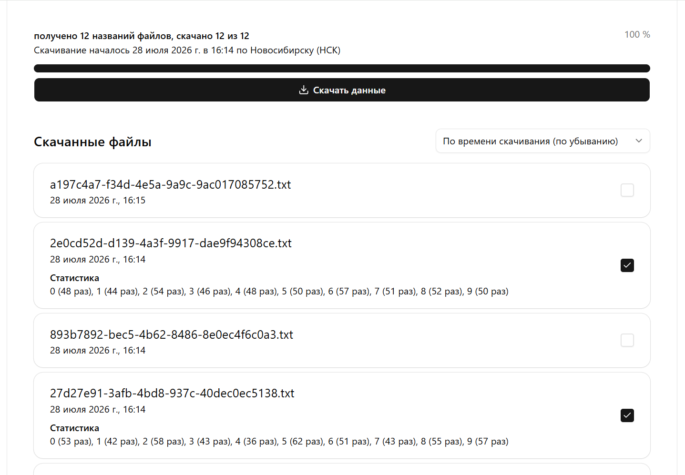
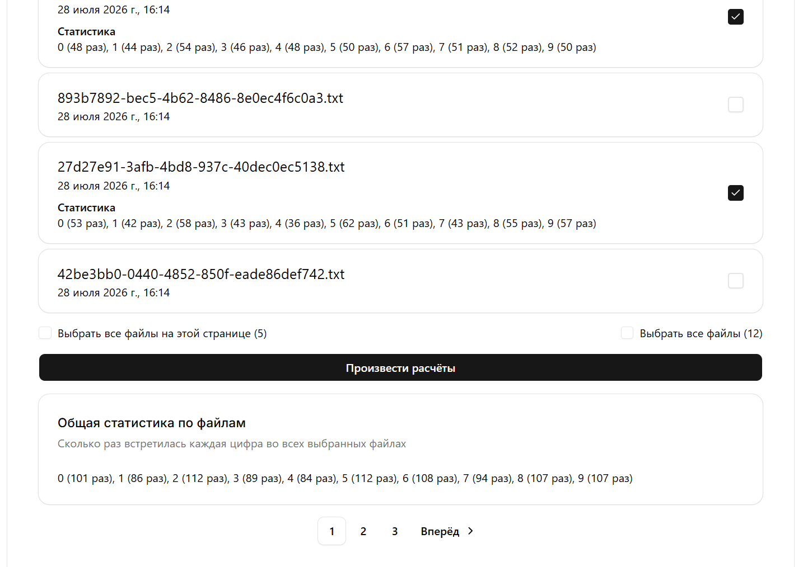

# File Catalog

Сайт для скачивания и анализа текстовых файлов.  
https://file-catalog.classflow.ru  
https://file-catalog.classflow.ru/api/docs

### Мой телеграм: @bigbeardev




## Стек

### Backend
- Python
- FastAPI
- SQLAlchemy
- Alembic
- Dishka
- PostgreSQL
- Docker
- Nginx

### Frontend
- Typescript
- React
- Tailwind
- Shadcn

## Качество кода

Проект использует `mypy` для проверки типов,
`ruff` для форматирования кода в общем стиле,
`pre-commit` для запуска проверок перед коммитами
и `pytest` для тестов.

Настроен `CI/CD` с автоматическим запуском всех проверок, тестов и автодеплоем.


## Запуск

1. Создайте `backend/.env` и `frontend/.env` по примеру `backend/.env.example` и `frontend/.env.example`

2. Запустите проект с помощью Docker
```
make up
# или
docker-compose up --build -d
```